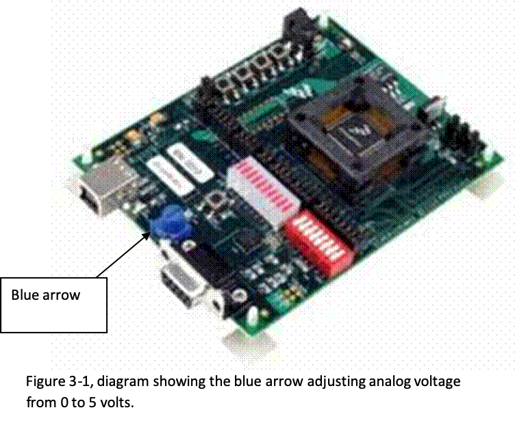
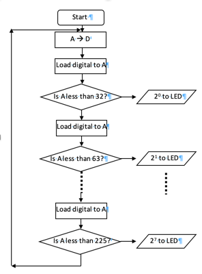

# Third Exercise - Analogue to Digital Conversion

This program ([ADC.asm](ADC.asm)) is used to convert an analogue voltage (0-5 volts) to digital numbers (0-255). When running this program, by manually tuning the blue arrow shown in the Figure 3-1 from position 1 to position 3, the analogue voltage increases from 0 to 5 volts. As the voltage increases from 0 to 5 volts, the output of the analogue to digital converter (ADC) increases from 00000000<sub>2</sub> to 11111111<sub>2</sub> linearly, and this number is displayed by the LEDs.



The main section in the ADC program is:

```
START_ADC		
    LDA    #%00001000    ;Kick off a conversion
    STA    ADC1SC1       ;on ADC channel 8 (PTD0)
WAIT_ADC
    TST    ADC1SC1       ;Look at ADC status register
    BPL    WAIT_ADC      ;Loop if ADC not finished conversion 
                         ;branch if (N) is 0
    LDA    ADC1RL        ;Load data from ADC
    STA    PTFD          ;Send to the LED bar
    
    BRA    START_ADC         ;Repeat
```

## Your Task

Modify above section of the program to have the following output.


When the digital number ranges from 0 to 31, LED1 is lit, when the digital number ranges from 32 to 63, LED2 is lit, and so on.

Flowchart of the modification: (you may modify the program according to the following flowchart)


