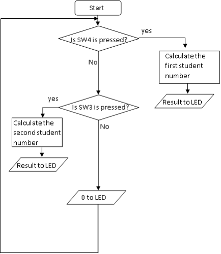

# Fourth Exercise - a C program for adding up a 6-or-7-digit student number. 

This program ([progC.c](progC.c)) is used to sum up 6-digit student number. When running this program, the LED displays the sum of a 6-digit student number. For example, if your student number is 111111, then the 2nd and 3rd LEDs will be lit to display the decimal number 6. The program is written in C language, and all the heading files to define ports on the demo board are included. The main section in the progC.c for you to make modification is:

```C
//student number addition code starts here //
			   
			 
counter1 = 0;     //initialize counter to zero at the beginning	
			        
total_answer = 0; //initialize total answer to zero at the beginning
			        
while (counter1 < STUDENT_COUNT)
{
  total_answer = total_answer + student_number_1[counter1++];  // add the first student number to total answer and                                                                                      // increment counter by 1
}
			           
PTFD = total_answer;//send the final answer to the LEDs				
			 
//student number addition code ends here//
```

## Task 1:

Note the above section of the program is constructed using ‘while’ loop. Use a ‘for’ loop to achieve same purpose. 

*Hint*: the standard format for ‘for’ loop is 

```c
for (i = 0; i < size_of_array-1; i++)
{
  statement;
  statement;
  :
}
```

## Task 2:

Modify the `progC.c` to achieve the following function: 

LED displays the sum of the first student number when pressing down `SW4`, and LED displays the sum of the second student number when pressing down `SW3`. LED displays zero when no button is pressed.

*Hints*: 

* use ‘if’ statement to setup conditions. 
* `PTDD_PTDD2` represents `SW4`, and `PTDD_PTDD3` represents `SW3`. 
* Use hash-defines (`#define`) to declare all constants.

The flowchart for the modification is shown in Figure 1:



**Figure 1: Flowchart of the modification**

